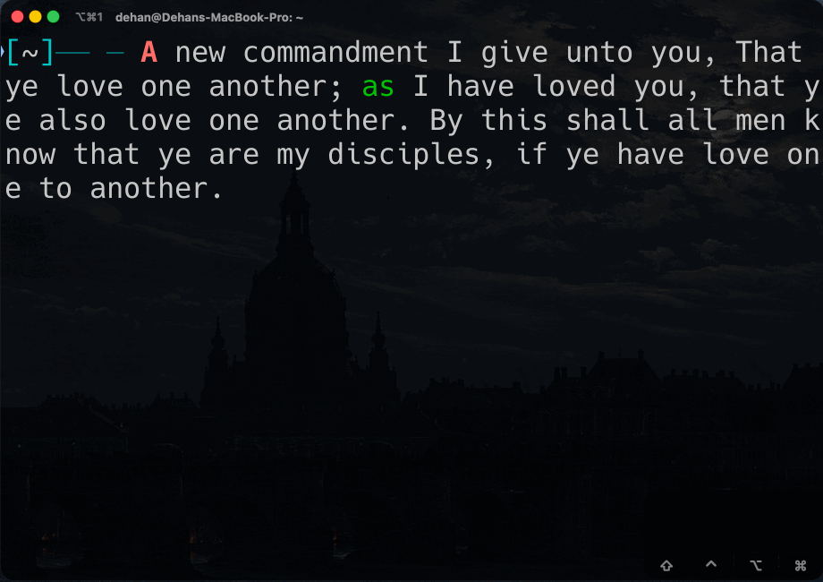

<!-- To Katherine With Love -->

# zsh-easymotion

Jump to any character in your Zsh command line.

[](https://github.com/DehanLUO/self-test/actions)
[](https://github.com/DehanLUO/self-test/actions)



---

## Features

1. __Word start navigation__
  <kbd>Ctrl</kbd>+<kbd>X</kbd> <kbd>W</kbd>: Shows markers at the first character of each word
2. __Word end navigation__
  <kbd>Ctrl</kbd>+<kbd>X</kbd> <kbd>E</kbd>: Shows markers at the last character of each word
3. __Search character navigation__
  <kbd>Ctrl</kbd>+<kbd>X</kbd> <kbd>F</kbd>: Prompts for a character, then shows markers at all occurrences

## Installation

### Using Zim

Add this to your `.zimrc`:

```sh
zmodule DehanLUO/zsh-easymotion
```

### Manual Installation

1. Clone the repository:

```sh
git clone https://github.com/DehanLUO/zsh-easymotion ~/.zsh/zsh-easymotion
```

2. Source the plugin in your `.zshrc`:

```sh
source ~/.zsh/zsh-easymotion/init.zsh
```

3. Start a new terminal session or reload your shell configuration.

## Configuration

Customise behaviour and appearance using zstyle. Add these to your `.zshrc`:

```sh
# Available jump keys (default: a-z + semicolon)
zstyle ':zsh-easymotion:*' keys 'abcdefghijklmnopqrstuvwxyz;'

# Primary colour for single-key markers (default: bold red)
zstyle ':zsh-easymotion:*' fg-primary 'fg=196,bold'

# Secondary colour for first character of multi-key sequences (default: bold orange)
zstyle ':zsh-easymotion:*' fg-secondary 'fg=208,bold'

# Tertiary colour for remaining characters in multi-key sequences (default: bold brown)
zstyle ':zsh-easymotion:*' fg-tertiary 'fg=94,bold'

# Background dimming colour (default: bold black)
zstyle ':zsh-easymotion:*' fg-dim 'fg=black,bold'

# Search case sensitivity: default, ignorecase, or smartcase
zstyle ':zsh-easymotion:*' search-case 'default'

# Prompt for character search (supports colour codes)
zstyle ':zsh-easymotion:*' prompt-char '%{\e[1;32m%}Search for character:%{\e[0m%} '

# Prompt for jump key selection (supports colour codes)
zstyle ':zsh-easymotion:*' prompt-key '%{\e[1;32m%}Target key:%{\e[0m%} '
```

## Acknowledgements

Inspired by [vim-easymotion](https://github.com/easymotion/vim-easymotion) and [zce.zsh](https://github.com/hchbaw/zce.zsh).

## License

This project is licensed under the [MIT License](https://opensource.org/license/MIT). For the full text of the license, see the [LICENSE file](./LICENSE).